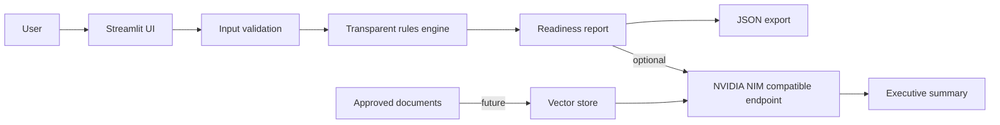

# Architecture

## Design rules
- The deterministic assessment works without an LLM.
- The LLM narrative is optional and cannot change the score.
- Assumptions and limitations are visible.
- No confidential information is needed for the public demo.
